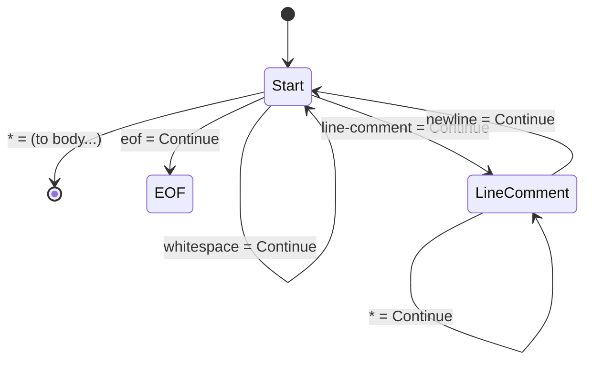
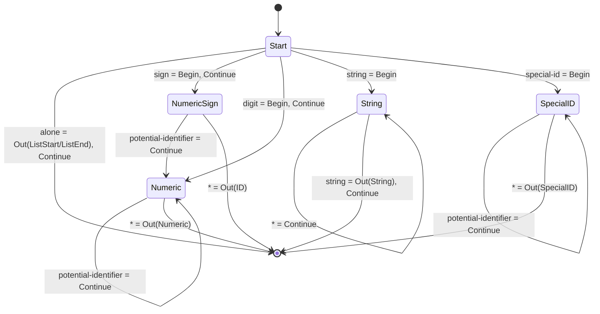

# Appendix: State Machine Diagrams

## Tokenizer

* Begin: Clear token's working buffer and begin pushing characters to it (but not this character, unless it is otherwise consumed).
* Continue: Consume character. Push it to working buffer if that is enabled.
* Out: Output token of type from working buffer, clearing working buffer, and stop pushing. _Does not consume the character._

### Whitespace

In tokenizers that use a "reads from" model, implementing consuming whitespace as a dedicated function can be helpful.

### Body

Assumes the whitespace at the beginning has been consumed.

When reading this diagram, EOF can be treated as an additional character class which is not part of any group.

